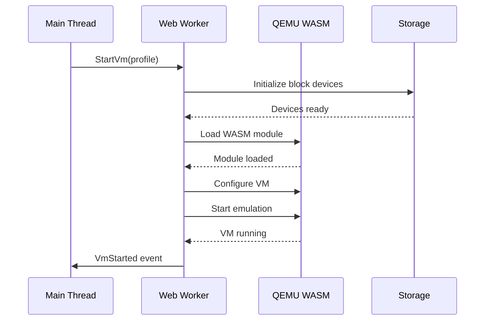
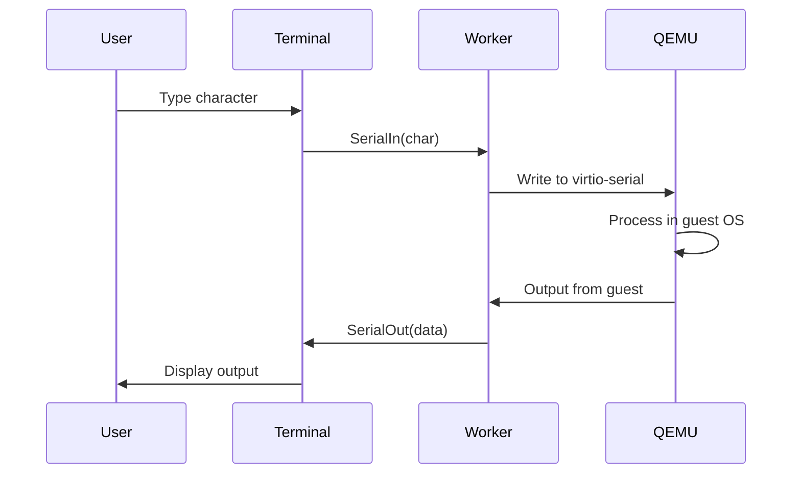

import { Aside, Card, CardGrid } from '@astrojs/starlight/components';

QemuWeb uses a layered architecture designed for performance, isolation, and maintainability. This page explains how all the components work together.

## High-Level Architecture

<div style="background: var(--sl-color-gray-6); border-radius: 1rem; padding: 1rem; margin: 2rem 0;">
  
</div>

The system is divided into three main layers:

### 1. Main Thread (UI Layer)

The main browser thread handles user interaction and orchestration:

- **React Application**: Modern UI with Tailwind CSS
- **Terminal UI**: xterm.js for serial console interaction
- **QemuClient**: High-level API for VM control
- **AI Agent**: LangGraph-based agent for AI automation
- **Services**: Network monitoring, logging, metrics

### 2. Web Worker (Execution Layer)

The Web Worker provides an isolated execution environment:

- **QEMU WASM**: The emulator compiled to WebAssembly
- **Worker Runtime**: Lifecycle management and I/O handling
- **Block Device Layer**: Virtual disk access
- **Event Loop**: Handles emulation cycles

### 3. Storage Layer (Persistence)

The storage layer manages all persistent data:

- **Block Devices**: Abstraction over different storage backends
- **COW Overlay**: Copy-on-Write for efficient snapshots
- **IndexedDB Backend**: Browser-native persistence
- **Atlas Store**: Content-addressed deduplication

## Package Dependencies

<div style="background: var(--sl-color-gray-6); border-radius: 1rem; padding: 1rem; margin: 2rem 0;">
  
</div>

### Monorepo Structure

```
qemuweb/
├── apps/
│   └── web/                 # React frontend
├── packages/
│   ├── qemu-wasm/          # QEMU → WebAssembly build
│   ├── runtime/            # Core runtime (Client + Worker)
│   ├── storage/            # Block devices + IndexedDB
│   ├── vm-config/          # VM profiles + networking
│   └── sidecar-proto/      # External communication
└── docs-site/              # This documentation
```

### Build Order

Turborepo orchestrates the build in dependency order:

1. **qemu-wasm**: Docker-based Emscripten compilation
2. **storage, vm-config, sidecar-proto**: Independent packages
3. **runtime**: Depends on all above packages
4. **web**: Depends on runtime (+ all transitive deps)

## Data Flow

### VM Startup Sequence



### Serial I/O Flow



## Key Design Decisions

### Why Web Workers?

<CardGrid>
  <Card title="UI Responsiveness" icon="rocket">
    QEMU's emulation loop would block the main thread, making the UI unresponsive. Workers run in parallel.
  </Card>
  <Card title="Isolation" icon="approve-check-circle">
    Workers have their own memory space. A crash in QEMU won't take down the page.
  </Card>
  <Card title="Security" icon="warning">
    Workers can't access the DOM or main thread state directly, providing an additional security boundary.
  </Card>
</CardGrid>

### Why Copy-on-Write Storage?

1. **Efficiency**: Only changed blocks are stored, not entire disk images
2. **Snapshots**: Easy to create and restore VM states
3. **Sharing**: Multiple VMs can share the same base image
4. **Speed**: Writes are fast (just mark as dirty), reads fall through to base

### Why Content-Addressed Storage (Atlas Store)?

1. **Deduplication**: Identical blocks stored once across all VMs
2. **Verification**: Hash = integrity check
3. **Delta Updates**: Only download new blocks when updating images
4. **Sparse Files**: Zero blocks are never stored

## Memory Model

### Main Thread Memory

- React component tree and state
- Terminal buffer (xterm.js)
- Client-side caches

### Worker Memory

- QEMU's WebAssembly linear memory (grows as needed)
- VM RAM allocation (configurable per profile)
- Block device buffers

### IndexedDB Storage

- Base disk images (content-addressed blocks)
- COW overlay (dirty blocks only)
- VM metadata and configurations

<Aside type="tip">
  Memory usage scales with VM RAM allocation. A 128MB VM typically uses ~200MB of browser memory including overhead.
</Aside>

## Threading Model

```
┌─────────────────────────────────────────────────────────────┐
│                        Browser Process                       │
├─────────────────────────────────────────────────────────────┤
│  Main Thread                                                 │
│  ┌─────────────────────────────────────────────────────────┐│
│  │ React App │ QemuClient │ AI Agent │ Event Handlers      ││
│  └─────────────────────────────────────────────────────────┘│
│                              ↕ postMessage                   │
│  Web Worker                                                  │
│  ┌─────────────────────────────────────────────────────────┐│
│  │ Worker Runtime │ QEMU WASM │ Block Devices              ││
│  └─────────────────────────────────────────────────────────┘│
│                              ↕ SharedArrayBuffer             │
│  ┌─────────────────────────────────────────────────────────┐│
│  │                    IndexedDB                             ││
│  └─────────────────────────────────────────────────────────┘│
└─────────────────────────────────────────────────────────────┘
```

## Error Handling

### Graceful Degradation

1. **Missing SharedArrayBuffer**: Show error message with server configuration instructions
2. **WASM Load Failure**: Retry with exponential backoff, then show error
3. **Storage Quota Exceeded**: Prompt user to free space or request persistent storage
4. **VM Crash**: Capture error, offer restart option

### Error Propagation

```typescript
// Errors flow from Worker → Client → Application
client.on('error', (error) => {
  if (error.code === 'VM_CRASH') {
    // QEMU crashed - offer restart
  } else if (error.code === 'STORAGE_FULL') {
    // IndexedDB quota exceeded
  } else if (error.code === 'WASM_LOAD_FAILED') {
    // Could not load QEMU WASM
  }
});
```

## Performance Considerations

### Bottlenecks

1. **WASM Execution**: Single-threaded emulation (pthreads support planned)
2. **Block I/O**: IndexedDB transactions can be slow
3. **Memory Pressure**: Large VMs compete with browser for RAM

### Optimizations

1. **Block Caching**: Frequently accessed blocks cached in memory
2. **Lazy Loading**: Base images loaded on-demand
3. **Write Coalescing**: Multiple writes batched into single IndexedDB transaction
4. **SIMD**: WASM SIMD used when available for faster emulation

## Next Steps

<CardGrid>
  <Card title="Worker Protocol" icon="document">
    Deep dive into the postMessage communication protocol.
    
    [Learn more →](/qemuweb/architecture/worker-protocol/)
  </Card>
  <Card title="Storage System" icon="document">
    Understand COW storage and content-addressed deduplication.
    
    [Learn more →](/qemuweb/architecture/storage/)
  </Card>
</CardGrid>
